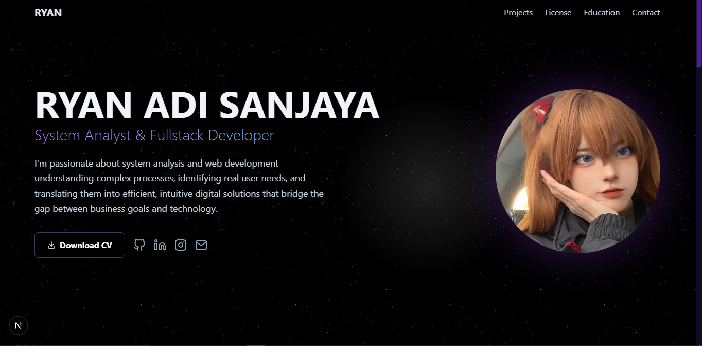

# 🌐 Personal Web Profile Template

This is a **personal web profile template** built using **Next.js** and **Tailwind CSS**. It's designed for developers, designers, and creators who want a clean, responsive, and customizable personal site.

## 🚀 Features

- Built with **Next.js 14+**
- Styled using **Tailwind CSS**
- Smooth animations with **Framer Motion**
- Clean, reusable component structure
- Responsive (Mobile-first)
- SEO-friendly
- Easy to deploy on **Vercel**

## 🖼️ Preview



## 📁 Folder Structure

```bash
.
├── app/ # Application entry (Next.js App Router)
│ ├── page.js # Home page
│ ├── globals.css # Global styles
│ ├── layout.js # Root layout
│ └── components/
│ ├── layout/ # Layout-related components (Navbar, Footer, etc.)
│ ├── sections/ # Page sections (Hero, Features, etc.)
│ ├── ui/ # Reusable UI components 
│ └── data/ # Static data 
├── public/ # Static files (images, favicon, etc.)
├── node_modules/ # Project dependencies
├── tailwind.config.js # Tailwind CSS configuration
├── README.md # Project documentation
```
